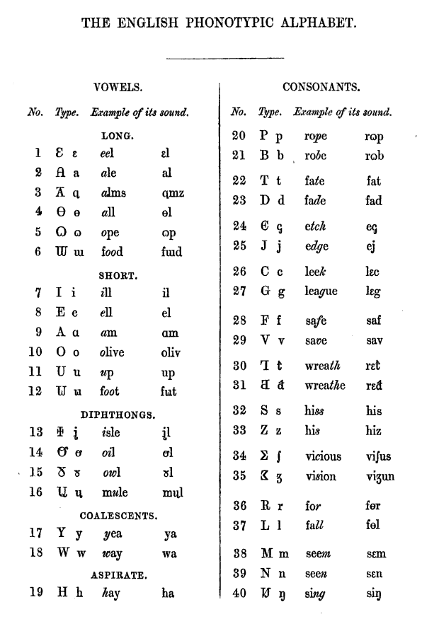

# On Solving a Concensus on English Pronunciation
The English is well known for phonetic-spelling discordance among European language, so that an IPA notation is required for a dictionary to pronounce words (along with [French](/fr/README.md)), which has been rising into concern of billions of world English learners.

```
Symbols
a-z  true letters
C    any consonant but otherwise specified
V    any vowel but otherwise specified
^    word beginning
$    word end
,    separator
```

## Pronunciation-Spelling Concordance
Stressed and only stressed vowel are to be marked on dictionaries, with full IPA given to and only to irregularly pronounced words.



### Vowels
|[EPA](https://en.wikipedia.org/wiki/English_Phonotypic_alphabet)|Gen. Est.|Gen. Am.|Gen. Aus
|-|-|-|-
|/iː/|/iː/|/iː/|/ɪi/
|/eː/|/eɪ/|/eɪ/|/æɪ/
|/ɑː/|/ɑː/|/ɑː/|/ɑː/
|/ɔː/|/ɔː/|/ɔː/|/ɔː/
|/oː/|/əʊ/|/oʊ/|/oʊ/
|/uː/|/uː/|/uː/|/ʊu/
|/ɪ/|/ɪ/|/ɪ/|/ɪ/
|/ɛ/|/e/|/ɛ/|/e/
|/æ/|/æ/|/æ/|/æ/
|/ɒ/|/ɒ/|/ɑ/, /ɔ/|/ɒ/
|/ʌ/|/ʌ/|/ʌ/|/ɐ/
|/ʊ/|/ʊ/|/ʊ/|/ʊ/
|/aɪ̯/|/aɪ/|/aɪ/|/aɪ/
|/aʊ̯/|/aʊ/|/aʊ/|/aʊ/
|/ɪʊ̯/|/juː/|/juː/|/juː/
|/ɔɪ̯/|/ɔɪ/|/ɔɪ/|/ɔɪ/

See [here](https://en.wikipedia.org/wiki/Sound_correspondences_between_English_accents) for more accents

|Letter(s)|Long|Short|R-Hevvy
|-|-|-|-
|a|/eː/|/æ/|/ɑː/
|e|/iː/|/ɛ/|/ɜː/
|i|/aɪ̯/|/ɪ/|/ɜː/
|o|/oː/|/ɒ/|/ɔː/
|u|/ɪʊ̯/|/ʌ/|/ɜː/
|w|/uː/|/ʊ/|-
|y|/aɪ̯/|/ɪ/|-

- R-Hevvy vowels cum before R or RR not followed by vowels.

|Digraph(s)|Allways long
|-|-
|ae, ai, ay|/eː/
|au, aw|/ɔː/
|ea, ee|/iː/
|ei, ey|/eː/
|eu, ew|/ɪʊ̯/
|ie, ye|/aɪ̯/
|oa, oe|/oː/
|oi, oy|/ɔɪ̯/
|oo|/uː/
|ou, ow|/aʊ̯/
|ue|/ɪʊ̯/
|ui, uy|/aɪ̯/

|Stress, in dictionaries|Long|Short
|-|-|-
|Primary|`"`|`'`
|Secondary|`,`|`.`

Notes:
1. Isaac Pitman's Ingglish Phonotypic Alphabet and Dezzeret runes (created 1847) suggested then-General American Pronunciation.
2. /ɜː/ was reccognized as the allophone of /ʌ/ before /ɹ/ in the 19th century United States.
3. fore = foar (number 4) /foːɹ/ ≠ for /fɔɹ/
4. Short vowels are reccognized with singgle vowels. Singgle unstressed vowel letters allways sound /ə/, but final I (/aɪ̯/), O (/oː/), U (/u/), and Y (/i/).
5. 

The word _**recieved** pronunciation_ implies that the British government has never been trying to subjectively define the standard pronunciation of English in the United Kingdom or England; though it is sometimes referred as "the King/Queen's English", the Kings and Queens has never exercised their power to regulate English, as one thereamong, [George I](https://en.wikipedia.org/wiki/George_I_of_Great_Britain) (28 May 1660 – 11 June 1727) lost all of his "real" powers due to incapabillity of speaking English, which is far from internationality before Two World Wars in the 20th century. Also, the so-called "Recieved Pronounciation" is only practiced in 3% of population in Inggland.

### `ough`
|Pronunciation|Examples|Note
|-|-|-
|/ʌf/|Brough, chough, clough, enough, Hough, rough, slough (see below), sough, tough|Rhymes with _-uff_. Clough and sough are also pronounced /aʊ/.
|/ɒf/|cough, Gough, trough|Rhymes with _-off_. Trough is pronounced /trɔːθ/ (_troth_) by some speakers of American English, and a baker's _trough_ is also pronounced /troʊ/.[2]
|/aʊ/|bough, clough, doughty, drought, plough, slough (see below), Slough, sough|Rhymes with _cow_. _Clough_ and _sough_ are also pronounced /ʌf/. _Plough_ is generally spelled _plow_ in American English.
|/oʊ/|brougham, dough, furlough, though|Rhymes with _no_, _toe_. Brougham is also pronounced /uː/.
|/ɔː/|bought, brought, fought, nought, ought, sought, thought, wrought|Rhymes with _caught_, _taught_.
|/uː/|brougham, slough (see below), through|Rhymes with _true_, _woo_. Brougham is also pronounced /oʊ/.
|/ə/|borough, Poughkeepsie, thorough, Willoughby|_Borough_ and _thorough_ are pronounced /oʊ/ in American English, thus rhyming with _-urrow_.
|/ʌp/, /əp/|hiccough|→ _hiccup_.
|/əf/|Greenough|/ˈɡrɛnəf/ as an Australian river, and /ˈɡriːnoʊ/ as a surname.
|/ɒk/|Clough, hough|Rhymes with -ock. _Hough_ → _hock_.
|/ɒx/|Brough, lough, turlough|Rhymes with loch. Many speakers substitute /k/ for /x/.

### Silent letters
Some proposed simplified spellings already exist as standard or variant spellings in old literature. In the 16th century, some Graeco-Latin literaturists tried to make English words look akin to their Graeco-Latin counterparts, at times even erroneously, by adding silent letters, so
- _det_ became _debt_,
- _dout_ became _doubt_,
- _sithe_ became _scythe_,
- _iland_ became _island_,
- _ake_ became _ache_, and so on.
However, We propose undoing these changes. Other examples of older spellings that are more phonetic include
- **_frend_** for _friend_ (acceptable, as on Shakespeare's grave),
- _agenst_ for **_against_** (again +‎ -st [excrescent]),
- _yeeld_ for **_yield_** (_cf._ Old English _ġieldan_),
- _bild_ for **_build_** (_cf._ Old English _byldan_),
- **_cort_** for _court_ (_cf._ French _cort_, Latin _cohort_),
- **_sted_** for _stead_ (_cf._ Old English _stede_, also _insted_),
- **_delite_** for _delight_ (_cf._ French _delite_),
- **_gost_** for _ghost_,
- **_harth_** for _hearth_,
- _rime_ for **_rhyme_** (_cf._ greek _ρυθμός_),
- _sum_ for **_some_**,
- _tung_ for **_tongue_**, and many others.
Some of spellings are occasionally to be given in dictionaries for pronunciation, as being far from words of their origins.

### An hour, an heir, an honor, an honest man...
For dialectal scalability and concerning British withdrawing from EU (_known as_ [Brexit](https://en.wikipedia.org/wiki/Brexit)), words that begin with vowel letters or "h" in Greek or Latin lexicons, is attached to "an", otherwise "a". Confer French [_l'oiseau_](https://en.wiktionary.org/wiki/oiseau) (/l ͜ wazo/, the bird), [_aujourd'hui_](https://en.wiktionary.org/wiki/aujourd'hui) (/oʒuʁd ͜ ɥi/, today), etc..
> An US dollar is less than an Euro, and never will it be more.
