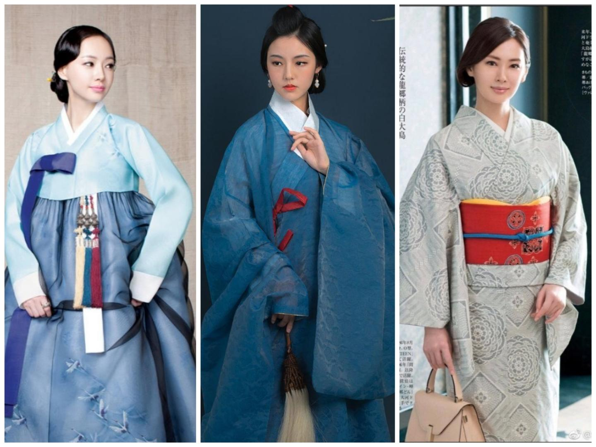

# 告華夏同袍書
某言：「中國有禮儀之大故稱夏，有章服之美謂之華。」華夏四千八百歲，何國而經久如此？吾國正華夏語音以爲國語，正華夏文字以爲國字，何苦而不能正[華夏衣冠](https://www.doc88.com/p-97116069314219.html)以爲國服？

上古人民少而禽獸眾，穴居而野處，衣毛冒皮足以禦寒，漁獵足以充飢。後人民進而禽獸退，漁獵不足養身，遂耕五穀以爲養，樹五果以爲助，植五菜以爲充，長五畜以爲益，氣味合而服之，以補精益氣；是時，民衣麻、葛，黃帝元妃嫘祖見或不足，教民以蠶，繅絲以爲暖。

《易傳》曰：「黃帝、堯、舜垂衣裳而天下治，蓋取諸乾坤。」堯、舜既歿，夏禹、商湯、周發、秦政禮義相因，而其色不同，以其五行五德故也。秦政暴民，劉漢弭之，欲復周禮，百餘年而二戴著之，以爲萬世之用可也。

後漢傾頽，人相攻殺，四人已去其三矣；至司馬氏平三國，不久而[宗室操戈](https://baike.baidu.com/item/八王之亂)，五胡見機，割据中原，立國稱帝，其[一](https://baike.baidu.com/item/羯族)見漢人女子，夜則淫，晝則烹。漢族蒙難，幾近亡種，[或](https://baike.baidu.com/item/冉閔)忍辱負重，屈身胡國，陰令内鬥，是時「趙人斬一胡首送鳳陽門者，文官進位三等，武官悉拜牙門。」胡人見之色變，[三載而亡冉魏](https://baike.baidu.com/item/慕容儁)，而漢人未能爲所滅也。自是而二百年，「中國衣冠，自北齊以來，乃全用胡服。窄袖、緋綠短衣、長靿靴、有蹀躞帶，皆胡服也……開元之後，雖仍舊俗，而稍褒博矣。然帶鉤尚穿帶本爲孔，本朝加順折，茂人文也。」趙宋《夢溪筆談》猶此，蒙古質孫服亦見于朱明之朝，華族之服未用廢也。

後滿洲入主中原，屠戮華夏，剃髮易服。或謂「康乾間滿漢民服皆存」，實畫作也，虛構也，及至嘉慶，所始易服者盡歿，故民未見華服，何以圖之？或謂「十從十不從」，女子、僧道、優伶悉稍從之，衣襟見化于滿，右不帶乎左，獨馬面裙存焉。道光、咸豐，泰西列族亦入中原，然後滿清「師夷長技以制夷」，入洋銃洋炮以戰，洋服隨而入諸夏；光緒甲午，滿清失高麗乎日本，以日本三十倍之土地，五倍之人民，何苦修《馬關條約》，割臺灣、流巨銀，令興工事、瓜分豆剖，而不聼其登陸、南下而久戰？所欲毀約再戰者，皆諸夏人也。韃子治國必不如共和國，結黨必不如共產黨，何爲虛取容納之名，染於人口！子曰：「夷狄之有君，不如諸夏之亡也。」

宣統壬子，諸夏既逐滿洲，立民國，剪辮放足，男女平權，然後[勝歐西](https://baike.baidu.com/item/第一次世界大戰)，[克日本](https://baike.baidu.com/item/第二次世界大戰)，始中華民族復興之大計。孫中山引洋服而造以中華禮義，袁慰廷復玄端、深衣，一則曰「驅除韃虜，恢復中華」。未幾袁卒，玄端、深衣之事見棄，以爲專制之存；中山薨而蔣氏剿共，復前清旗袍、馬褂。三十八年，人民共和國立，旗袍、馬褂亦以封建主、資本家之故盡去矣。六十七年，吾國改革開放，市場自由，華夏衣冠盡爲洋人所化也。

或曰：「夫西服未文，然衣制嚴肅，領袖白潔，衣長後衽，乃孔子三統之一。大冠似箕，为漢世士夫之遺，革舄为楚靈王之制，短衣为齊桓之服。」此乃[前清遺臣](https://baike.baidu.com/item/康有爲/113297)之言，人怨而民攻之。

九十二年，[一人](https://baike.baidu.com/item/王樂天)華服上道，而民知之，然後大國覺醒，華夏衣冠遂得復興矣。華夏衣冠之復興，傳承并重，精神爲上，形制爲次，至[革命成功之再辛亥](https://baike.baidu.com/item/2031年)，華夏衣冠必代中山裝、慶齡衫于五十五族之前也。

[臺灣之上京者](https://baike.baidu.com/item/王明珂)言，當滿清入主之時，歐洲恃海陸軍事之進步，列國爭拓土殖民，搜刮財貨于亞非美澳四洲，故四洲之智者，一求團結，二求進步，民族主義遂興矣；而鄉土之傳統文化，一則揚民族之歷史以固團結，二則以爲落伍守舊乎列邦、非進步之義，是以男子、市民、多數民族之心居者，自豪而遠之；女子、鄉民、少數民族之邊居者，自負而近之。故亞洲回教未及之處，實男子多洋服，女子多民服也；教育部編《語文·小一上冊》之開卷，五十五族各服其服，而漢族之服未見，代以時裝，一也。此乃陽求同、陰存異之則：守正而不復古，創新而不輕源。

華夏衣冠何所有也？[一曰體服，二曰首服，三曰足服，四曰配飾](https://www.doc88.com/p-57316028484755.html)。其體也完，其系也備，其構、材、紋、著皆久習成俗，其史也五千年，其氣也蓄斂，其質也莊重，其形也十六字，曰「平中交右、寬褖合纓、豐骨冠表、垂提隱正」。
- 平者，平裁對折，不破肩綫，別華夷也。
- 中者，中縫對稱，左右均分，守中正也。
- 交者，規矩方圓，上下交叠，合陰陽也。
- 右者，交領右衽，遮掩尚右，章文明也。
- 寬者，寬袼松擺，縫齊倍要，法自然也。
- 褖者，禮衣必褖，續衽勾邊，明禮義也。
- 合者，腹手合袖，禮服回肘，和合共也。
- 纓者，隱扣繫帶，佩綬結纓，展風貌也。
- 豐者，豐偉上身，儉豐相宜，行正大也。
- 骨者，接縫爲骨，出袼趨收，濟剛柔也。
- 冠者，冠髻寬服，顏展身舒，展大氣也。
- 表者，虛表實裏，衣錦尚絅，惡著文也。
- 垂者，衣褶縱垂，忌交十字，象經緯也。
- 提者，布條圍頸，提衽規襟，勢乾坤也。
- 隱者，襟必齊整，扣必隱順，質無痕也。
- 正者，袷形端正，不偏不褂，端雅正也。

何人何時以服之？遂作指南如下。
- 中國人用洋禮則洋之，洋人進于中國則中國之。是乃效[孔子作《春秋》](https://zh.wikisource.org/wiki/原道)之法也。
- 奏洋樂則洋服，奏華樂則華服。
- 男鞶革，女鞶絲。
- 質料限用國貨。

中國（中）、日本（右）、高麗（左）女子，圖源：[知乎](https://zhuanlan.zhihu.com/p/717631734)

## 禮服
|一般禮服|女性|男性
|-|-|-
|體服|朝[展衣](https://baike.baidu.com/item/展衣)，夕[褖衣](https://baike.baidu.com/item/褖衣)，皆深衣也。|朝[玄端](https://baike.baidu.com/item/玄端)，夕[深衣](https://baike.baidu.com/item/深衣)。
|首服|小冠，與衣同色。|玄冠。
|足服|與衣同色。|與裳或深衣同色。

女男禮服皆以素紗爲裏，示其德之一也。今之端服，衣五正色、裳十間色，而擇其宜也。「深衣三袪，縫齊倍要，衽當旁，袂可以回肘。長中繼掩尺。袷二寸，祛尺二寸，緣廣寸半。以帛裹布，非禮也。」

### 冠禮
學位之禮考古冠禮。《冠義》曰：「冠者，禮之始也。是故古者聖王重冠。」
三王之時，[士有三冠之禮](https://ctext.org/yili/shi-guan-li/zh)，初加緇冠以象本，次加皮弁以令忠信，次加爵弁以令篤敬。周室衰而滅于秦，始皇焚書，禮教凌遲，至於趙宋，朱熹撰《家禮》，謂「男子十五至二十歲皆可冠」者，刺時也。

今者，男女六歲皆强令入小學，十二歲入中學，故人得初冠於初中、再冠於高中、三冠於大學，皆以畢業之日爲期；以校長爲主人，黨委爲正賓，導師爲贊者，宜矣。

#### 始加儒巾
女子同。
辭曰：「令月吉日，始加元服，棄爾幼字，順爾成德。壽考惟祺，介爾景福。」

#### 再加帽子
女子同。
辭曰：「吉月令辰，乃申爾服，敬爾威仪，淑慎爾德。眉壽萬年，永受胡福。」

#### 三加公服
辭曰：「以歲之正，以月之令，咸加爾服。兄弟具在，以成厥德，黄耇無疆，受天之慶。」
首服：男子用幞頭帽，女子用小冠。
體服：男子，士玄端，緇帶、韎韐。學士。女子，褖衣，衣裳相連，黑色而赤緣。

護領：
- 諸文，粉色（文學、史學、哲學、法學、教育學、藝術學，含諸文交叉門類）；
- 諸理，灰色（理學、經濟學、管理學，含諸理交叉門類）；
- 工學，黃色（含新工科交叉門類）；
- 農學，綠色（含新農科交叉門類）；
- 醫學，白色（含新醫科交叉門類）；
- 軍事學，紅色（含公共安全門類）；
- 文理交叉，不明所主，紫色。
- 雙學位，左主右次。
- 港澳臺各依其色用之。

### 婚禮
古之[婚姻](https://ctext.org/yili/shi-hun-li/zh)，「合二姓之好，上以事宗廟，而下以繼後世也，故君子重之。」雖然，皆女入男家而不可反，「聘則爲妻，奔則爲妾」，以父系宗法之故，反者蠻夷也。民國迄今，男女平等，宗法用棄，夫從妻居者不以爲失，今而「兩頭婚」「走婚」盛行，或有賞子隨母姓之父者。

新郎：或西裝，或明進士袍服。
新娘：華服，赤色，鳳冠。
伴郎：與新郎同。
伴娘：華服，上白下赤，小冠。

### 喪禮
國家領導人之喪，舉哀七日，副國之喪，舉哀三日。
民衆之喪事，年八十五以上謂之全壽，富而康寧謂之全福，好德而無病痛謂之全終，三者備然後喜喪。

### 祭禮
今人唯物、無神，唯清明祭祖、九月三十日祭烈士、十二月十三日祭死難者耳。

### 鄉禮
五十以上行鄉飲酒禮，不足者行鄉射禮，均依《儀禮》而作。

### 相見
吾國主席夫婦相見于列邦政要，男子洋服，女子華服鳳冠。
公民之相見，抱拳而拜。《内則》曰：「凡男拜尚左手，女拜尚右手。」
在職，下級居西先拜，上級居東答之，不辨則互拜。不在職，幼施長受，不辨則互施。

## 正裝
往來、應試、辦公時用。下裳至足面，去地五寸以上。

|女子正裝|描述
|-|-
|上衣|白色，交領、立領或對襟，袖長半臂以上，指尖以短。
|下裳|黑色，或織金織銀。馬面裙、旋裙、褶襉裙、百褶裙、無褶裙均可選。不短于一尺。
|首服|可選用小冠，與裳同色。
|足服|白襪、鞋用絲棉毛織品或革，色黑。

深衣，黑色。「制十有二幅以應十有二月，袂圜以應規，曲袷如矩以應方，負繩及踝以應直，下齊如權衡以應平。」
- 漢裙，馬面裙、旋裙、褶襉裙、百褶裙、無褶裙均可選。

大節大慶之盛裝，下裳至足面，去地一寸以上，五寸以下。
- 大節者，華曆元旦爲春節、端午爲夏節、中秋爲秋節、冬至爲冬節。
- 大慶者，二月十二日逐清慶、七月一日黨慶、九月三日逐倭慶、十月一日國慶。

## 便裝
居家、運動、出遊時用。上衣不過膝，下裳裙、袴、褌三種，去地五寸以上，配色、首服、足服聽便，毋令如禮服、盛裝。

## 跋
《史記》曰：「王者易姓受命，必慎始初，改正朔，易服色，推本天元，順承厥意。」今中華人民共和國，旗幟赤色，五星綴之，一大四小。大者共產之綱領，小者士農工商之同心。故山西孫韜《[萬八千言書](https://zhuanlan.zhihu.com/p/717631734)》題云：「漢服之復興，終於漢人生活也。」

甲辰年吉月吉日　愛國公民于結合網
