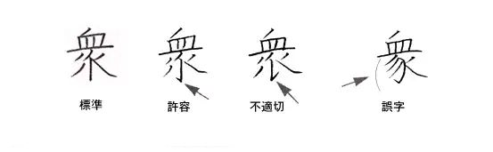

# 文字之法
昔黃帝之別於西羌，史官倉頡見鳥獸蹄迒之跡，知分理之可相別異，故依類象形，故謂之文。未幾，物廣而知進，遂有指事、形聲、會意以達其聲，即謂之字。文者，物象之本也；字者，孳乳而寖多也；著於竹帛謂之書，以迄五帝三王之世，改易殊體，封於泰山者七十有二代，靡有同焉。

《周禮》六藝：一曰五禮，二曰六樂，三曰五射，四曰五馭，五曰六書，六曰九數。六書者，一曰指事，二曰象形，三曰形聲，四曰會意，五曰轉注，六曰假借。\
指事者，視而可識，察而見意，「上」「下」是也；象形者，畫成其物，隨體詰詘，「日」「月」是也；形聲者，以事為名，取譬相成，「江」「河」是也；會意者，比類合誼，以見指撝，「武」「信」是也；轉注者，建類一首，同意相受，「考老」是也；假借者，本無其事，依聲託事，「舉」之爲「各」、「有」之爲「或」、「無」之爲「莫」是也。

及至秦吞二周、滅六國，乃易西周太史籀之大篆以爲小篆。漢隸、章草、魏碑、唐楷，盡顯其美，美美與共。大宋《重修廣韻》、大清《康熙字典》，定字形、音聲，以爲長治久安之道。

滿清敗於洋人，國人以漢字爲不便者多矣，遂欲易之以洋人之拉丁字母，或引俗字以爲正。民國二十四年，蔣中正《第一批簡體字表》，考《錢玄同八法》，收字三百二十四；二十六年，日本侵華，蔣公遷重慶，而漢字簡化之事見棄也。

三十八年，中華人民共和國立，以人民爲己任故，繼民國之遺願，[簡筆化字](../核心簡化字表.md)以易其書。蔣公居臺灣，事事與共和國反，正體字乃存也。

五十八年，日本入漢字於電腦，兩岸從之，乃知漢字簡化無所用矣。故吾從正體。

## 何簡何不簡
1. 手書簡，電子不簡。
2. 實用簡，文藝不簡。
3. 分離簡，合并不簡。

## 「通用規範漢字表」所復三十九字
可類推簡化者均得簡化。

迺：可用于姓氏人名、地名。  
椏：可用于姓氏人名、地名和科学技术术语，如「五桠果科」。  
耑：可用于姓氏人名，都官切。  
鉅：可用于姓氏人名、地名。  
昇：可用于姓氏人名。  
陞：可用于姓氏人名、地名。  
甯：可用于姓氏人名。  
颺：可用于姓氏人名。  
袷：袷袢，胡服名。  
麴：可用于姓氏人名。  
仝：可用于姓氏人名。  
甦：可用于姓氏人名。  
邨：可用于姓氏人名。  
氾：可用于姓氏人名，符元切。  
堃：可用于姓氏人名。  
犇：可用于姓氏人名。  
龢：可用于姓氏人名。  
逕：可用于姓氏人名、地名。  
鑪：化學元素名，序一〇三。  
線：可用于姓氏人名。  
釐：可用于姓氏人名，許基切。  
脩：乾肉也。  
絜：读xié或jié时，均可用于姓氏人名。  
扞：「扞格」之「扞」不作「捍」。  
喆：可用于姓氏人名。  
祕：可用于姓氏人名。  
頫：可用于姓氏人名。  
貲：計量也。  
叚：可用于姓氏人名，音霞。  
勣：可用于姓氏人名。  
菉：可用于姓氏人名、地名。  
蒐：春獵也。  
淼：可用于姓氏人名、地名。  
椀：橡椀，木名。  
谿：可用于姓氏人名。  
筦：可用于姓氏人名。  
澂：可用于姓氏人名。  
劄：目劄，疾名。  
吒：「哪吒」之「吒」不作「咤」。  

古籍見上字，不過類推簡化。

## 許容漢字
若「衆」字。

